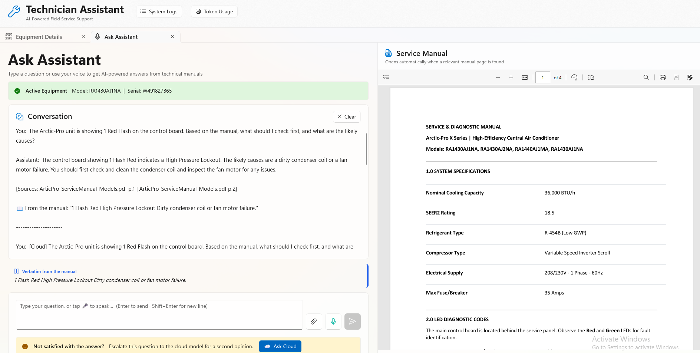
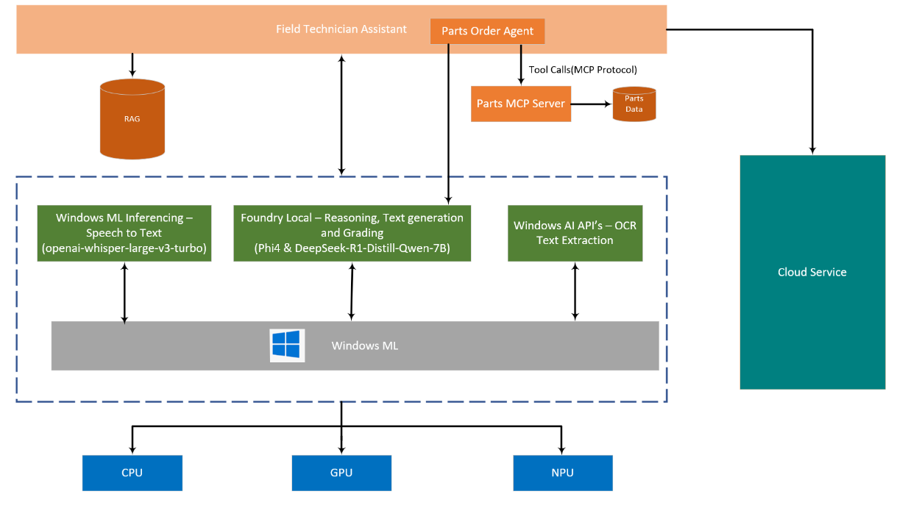
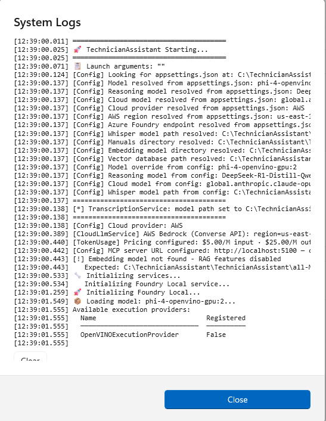
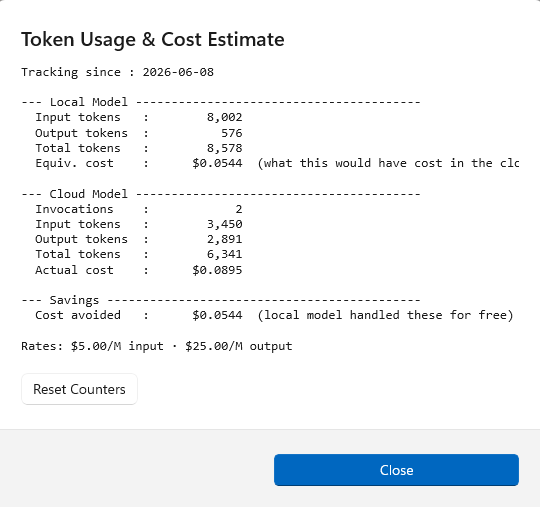

# Technician AI Assistant



## Overview

   This application demonstrates the complete Microsoft Foundry on Windows stack through a real-world technician assistant use case. It showcases how developers can integrate all three pillars of Microsoft Foundry on Windows: Windows AI APIs, Foundry Local, and Windows ML Inferencing APIs in a single, cohesive application.
   
   ### Windows AI API Demonstration:
   - Real-time OCR processing for equipment label extraction from camera input
   - Live audio capture and processing workflows
   ### Windows ML API Showcase:
   - On-device Whisper speech-to-text transcription with hands-free operation
   - Local model inferencing with OpenVINO GPU/NPU acceleration
   ### Foundry Local Integration:
   - Local AI models (Phi-4, DeepSeek-R1) with intelligent cloud escalation
   - RAG implementation using local vector databases
   - Hybrid local/cloud AI pipeline with confidence-based routing
   
   The technician assistant scenario provides a practical context for exploring these APIs, demonstrating how developers can build AI-powered applications that balance performance, privacy, and cost through intelligent local-first processing with cloud backup.
   
## Features

- 📸 **Real-time equipment photo analysis** with OCR label extraction
- 🎤 **Voice-activated queries** with speech-to-text processing
- 🤖 **Local AI processing** with intelligent cloud escalation
- 🔧 **Parts ordering agentic workflow** with inventory and pricing checks and live MCP server integration
- 📊 **Cost tracking and token usage analytics**
- 📚 **RAG-powered manual search** with embedded PDF viewer

## Architecture



This hybrid architecture delivers enterprise-grade AI assistance that is fast, private, cost-effective, and reliable in field environments — demonstrating how AI Foundry Local enables production-quality AI solutions with strategic cloud enhancement only when it adds real value.

## Prerequisites

### System Requirements
- **OS**: Windows 11H2
- **RAM**: 16GB minimum, 32GB recommended
- **Storage**: 10GB free space
- **GPU/NPU**: Intel GPU or NPU for optimal performance
- **Development**: Visual Studio 2022 or higher with .NET workload
- **Runtime**: Python 3.10+

### Optional Requirements
- AWS account with Bedrock access (for cloud escalation)
- Azure account with AI Foundry access (for cloud escalation)

## Setup Instructions

### 1. Service Manual Ingestion

1. Create  Python environment: python -m venv ingestion
2. Activate the env by running : ingestion\Scripts\activate
3. Install the required python packages: pip install -r requirements.txt
4. Run the script to generate the manuals database: python ingest-manuals.py
5. Copy the generated manuals.db into the Technician Assistant application root folder

### 2. Embedding Model Setup

1. Download the `model.onnx` file from [all-MiniLM-L6-v2 ONNX](https://huggingface.co/sentence-transformers/all-MiniLM-L6-v2/tree/main/onnx)
2. Download the `vocab.txt` file from [all-MiniLM-L6-v2](https://huggingface.co/sentence-transformers/all-MiniLM-L6-v2/tree/main)
3. Create folder `all-MiniLM-L6-v2` in the application root directory
4. Copy both downloaded files into this folder

### 3. Whisper Model Setup (Optional - for Speech-to-Text)

1. Create a new directory called say openai-whisper-large-v3-turbo and run command : cd openai-whisper-large-v3-turbo
2. Create a new python env for conversion: python -m venv whisper-conversion
3. Activate the env by running : whisper-conversion\Scripts\activate
4. Download requirements-IntelNPU.txt and requirements-IntelNPU-WP.txt from https://github.com/microsoft/olive-recipes/tree/main/.aitk/requirements into that directory
5. Run the commands:
       pip install -r requirements-IntelNPU.txt
       pip install -r requirements-IntelNPU-WP.txt
6. Download all the files from https://github.com/microsoft/olive-recipes/tree/main/openai-whisper-large-v3-turbo/aitk Altrenatively, you can download the following files:
   audio_processor_config_default.json
   whisper_large_v3_turbo_default_ov_npu.json
   whisper_large_v3_turbo_encapsulate.json
   convert_whisper_to_ovir.py
7. Run the command : python convert_whisper_to_ovir.py --output_dir whisper-large-v3-onnx --cache_dir whisper-large-v3-onnx_cache
8. Copy the folder whisper-large-v3-onnx with the model artifacts into the root folder of the Technician Assistant App

### 4. SQLite Vector Database Library

1. **Download sqlite-vec library:**
   - Download from [GitHub Releases](https://github.com/asg017/sqlite-vec/releases/download/v0.1.10-alpha.4/sqlite-vec-0.1.10-alpha.4-loadable-windows-x86_64.tar.gz)

2. **Install library:**
   - Extract the downloaded archive
   - Copy `vec0.dll` to the Technician Assistant application root folder

### 5. AWS Configuration (Optional - for Cloud Escalation)

⚠️ **Cost Warning**: Cloud escalation will incur charges on your AWS account

**Prerequisites:**
- Existing AWS account with Bedrock service access
- Multi-modal model support (text + image)
- Willingness to incur Gen AI usage costs

**Setup Steps:**

1. **Install AWS CLI:**
   - Follow the [official installation guide](https://docs.aws.amazon.com/cli/latest/userguide/getting-started-install.html)

2. **Configure AWS credentials:**
   - aws configure
   - Enter Access Key Id, Secret Access Key, Session Token, Region when prompted

3.  Update the `appsettings.json` file with your AWS details:
    - "CloudModelId": "your-cloud-model-id",
    - "CloudProvider": "AWS",   

### 6. Azure Configuration (Optional - for Cloud Escalation)

⚠️ **Cost Warning**: Cloud escalation will incur charges on your Azure account

**Prerequisites:**
- Existing Azure account with AI Foundry service access
- Willingness to incur Gen AI usage costs

1. **Configuration Steps:**

- Fetch the Azurwe Foundry API key from Azure.
- Update the `appsettings.json` file with your Azure details:

  "CloudModelId": "your-cloud-model-id",
  "CloudProvider": "AzureFoundry",
  "AzureFoundryEndpoint": "your-azure-api-endpoint",
  "AzureFoundryApiKey": "your-azure-api-key"


## Usage

### Quick Start

1. **Load the application:**
   - Open `TechnicianAssistant.sln` in Visual Studio

2. **Run the application:**
   - Build and run the application in Visual Studio (F5)

3. **Start MCP Server**
   - Open a command prompt and go to TechnicianAssistant.McpServer
   - dotnet run 

4. **Test OCR functionality:**
   - Navigate to the **Equipment Details** tab
   - Select the image `acimage.jpg` from the root project folder for OCR extraction

5. **Cloud escalation:**
   - If cloud services are configured, you can manually escalate to cloud at any time for expert opinion

### Example Queries

6. **Switch to Ask Assistant tab** and try these example prompts:

   **Diagnostic Questions:**

    a. The Arctic-Pro unit is showing 1 Red Flash on the control board. Based on the manual, what should I check first, and what are the likely causes?

    b. My liquid pressure is 318.4 PSIG and my liquid line temp is 95°F. Using the subcooling method for the APX-36, is the system properly charged?

    c. I am installing an APX-36 with a 35-foot line set. How much extra refrigerant do I need to add above the factory charge?

    d. I'm getting intermittent error code E4. It comes and goes every hour or so. The manual says it's a sensor fault but the sensor tests fine.

    e. Can I use an acidic cleaner to clean the coils on this model?   
    
    f. The compressor capacitor is bulging. Can you help order a replacement part

   Please note that the last prompt will trigger an agentic workflow to identify the part, calculate its availability etc.
### Voice Commands

7. 🎤 **Speech-to-Text functionality:**
- Voice commands can be used for all the above prompts if you have set up the Whisper model following the setup steps
- 📝 **Note:** When using Whisper on NPU, the first request may take time while the model compiles
- Switching Whisper from NPU to GPU:**

    The Whisper model can be run on GPU for potentially faster performance. To switch from NPU to GPU, edit `whisper-large-v3-onnx/genai_config.json` and change `device_type` from `"NPU"` to `"GPU"` in both sections:

    ```json
    {
    "decoder": {
        "session_options": {
        "log_id": "onnxruntime-genai",
        "provider_options": [
            {
            "OpenVINO": {
                "device_type": "GPU"
            
        ................
    },
    "encoder": {
        "session_options": {
        "log_id": "onnxruntime-genai",
        "provider_options": [
            {
            "OpenVINO": {
                "device_type": "GPU"
    ..................
    }
    ```

### System Monitoring

8. **View system information:**
- **System Logs:** Click the logs button at the top to access detailed system logs and troubleshooting information
- **Token Usage Analytics:** Click the token usage button to view:
  - Local vs. cloud token consumption
  - Cost savings generated by local processing

                    
