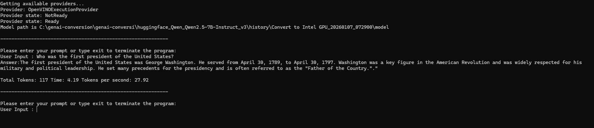

# Bring Your Own Model (BYOM)

## Software Prerequisites

1. **Install Visual Studio**

     Install Visual Studio 2022 Community edition with C++: Visual Studio 2022, selecting  ".Net desktop Development" and “Desktop Development with C++” workloads. If already installed please upgrade to 17.14
  
    
## Instructions for Running the Qwen3-8B Sample

Running the sample involves the model preparation phase that converts and quantizes the model using Olive recipe, followed by inferencing using Windows ML Runtime and Windows ML Runtime Intel OpenVINO EP.

### Model Preparation

1. **Quantize model for GPU**  
     Create the venv and then quantize the model for GPU by running the olive recipe:

     - cd olive-recipe
     - python -m venv olive-venv
     - pip install -r requirements
     - olive-venv\Scripts\activate
     - olive run --config qwen3_ov_config.json
     
     Quantized model will get generated under model/qwen3-8B

2. **Quantize model for NPU**  
     Create the venv if not already done so and then quantize the model for NPU by running the olive recipe:

     - cd olive-recipe
     - python -m venv olive-venv
     - pip install -r requirements
     - olive-venv\Scripts\activate
     - olive run --config qwen3_4B_npu_config.json
     
     Quantized model will get generated under model/Qwen3-4B_npu

### Model Inferencing

1. **Load the Solution**  
   Open `GenAIApplication.sln` located in the `GenAIApplication` directory.

2. **Build the Solution**  
   Run "Clean Solution" followed by "Build Solution".

3. **Set Command Line Arguments**  
   - Right-click on `GenAIApplication` > `Properties` > `Debug` > `Command line arguments`.
   - Specify the complete path for the model assets that were generated during the model preparation phase. For example for NPU:  
     `C:\build25-code\WinML\GenAIApplication\olive-recipe\model\Qwen3-4B_npu`

4. **Run the Project**  
   Execute the `GenAIApplication` project, and you should see a result similar to below.  
   